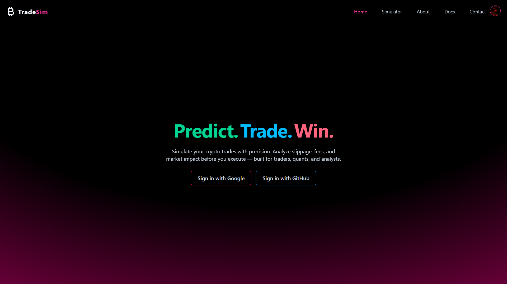
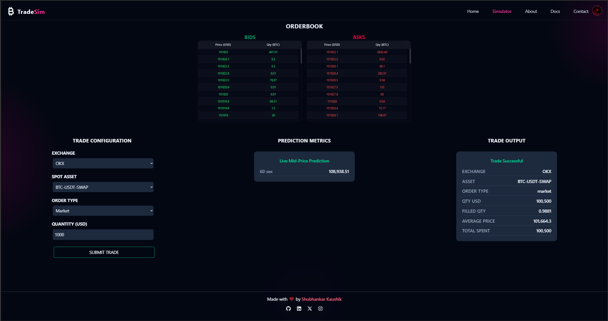
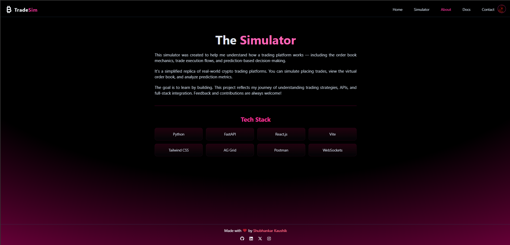
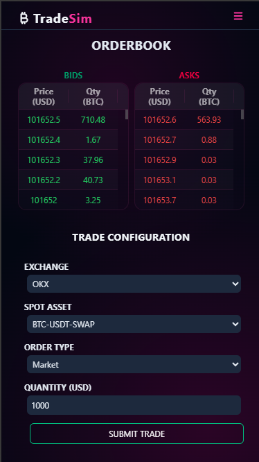

# 🚀 TradeSim

**TradeSim** is a **high-performance crypto trade simulator** built for low-latency environments. It processes live order book data in real time to calculate the **mid-price** and performs a **60-second predictive analysis** to help users anticipate short-term market trends.

---

## 🧠 Features

- ⚡ **Low-Latency Simulation**  
  Instant response to real-time order book updates.

- 📈 **60-Second Price Prediction**  
  Lightweight forecasting powered by recent mid-price movement trends.

- 🏦 **Order Book-Based Pricing**  
  Computes mid-price from dynamic bid-ask spread snapshots.

- 📱 **Fully Responsive Interface**  
  Works seamlessly across desktops and mobile devices.

---

## 🌐 Live App

Try the live simulator here:  
🔗 [Launch TradeSim](https://tradesim-shubhabha.vercel.app/)

---

## 🎥 Demo Video

Get a complete walkthrough of the interface and features:  
  
➡️ *(Click to watch on YouTube)*

---

## 🖥️ Interface Overview

### 🏠 Home Screen  

Overview of features and quick access to simulation tools.  

---

### 📊 Simulator Screen  

Run trade simulations and visualize predictions.  

---

### ℹ️ About Page  

App purpose, architecture, and vision.  

---

### 📞 Contact Page  

Submit feedback, report issues, or reach out.  

---

### 📱 Mobile View  

TradeSim adapts beautifully to smaller screens.  

---

### 📚 Documentation

For setup, usage, and technical details, check the full documentation:  
📘 [View Docusaurus Docs](https://punosie.github.io/TradeSim/)

---

## 👨‍💻 Developer

**Shubhankar Kaushik**  
📧 [shubhankar.kaushik2003@gmail.com](mailto:shubhankar.kaushik2003@gmail.com)

---

## 📄 License

This project is licensed under the [MIT License](LICENSE).
